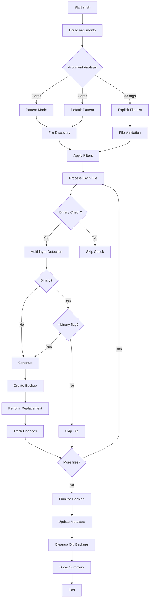
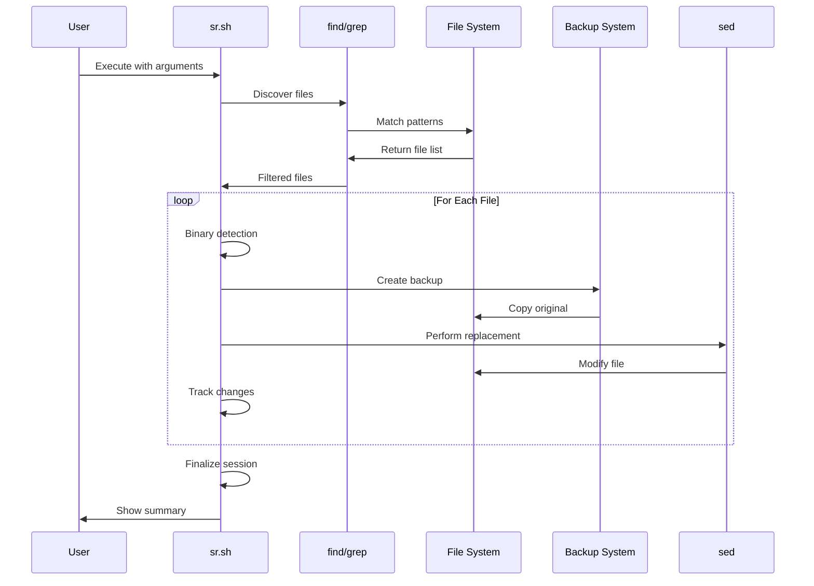
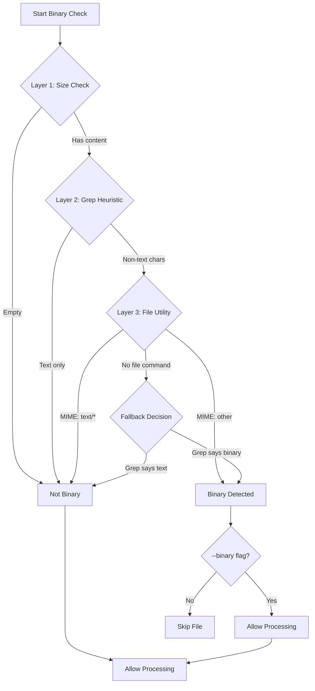

# Search & Replace (sr) - Universal Text Replacement Utility v6.1.0

[](https://github.com/paulmann/sr-search-replace/releases/tag/v6.1.0)
[](LICENSE)
[](https://www.gnu.org/software/bash/)
[](#system-requirements)
[](#system-requirements)
[](#prerequisites)
[](https://github.com/paulmann/sr-search-replace)

> **Enterprise-grade search and replace utility with session-based rollback, multi-layer binary detection, and advanced backup management**

## Table of Contents

1. [Overview](#overview)
2. [Quick Start](#quick-start)
3. [What's New in v6.1.0](#whats-new-in-v610)
4. [Key Features](#key-features)
5. [System Requirements](#system-requirements)
6. [Installation](#installation)
7. [Usage Guide](#usage-guide)
8. [Configuration](#configuration)
9. [How It Works](#how-it-works)
10. [Workflow Examples](#workflow-examples)
11. [Enterprise Deployment](#enterprise-deployment)
12. [Advanced Scenarios](#advanced-scenarios)
13. [Troubleshooting](#troubleshooting)
14. [Performance Optimization](#performance-optimization)
15. [Security Considerations](#security-considerations)
16. [Version History](#version-history)
17. [Contributing](#contributing)
18. [License](#license)
19. [Support](#support)
20. [FAQ](#faq)

## Overview

`sr` is a professional-grade command-line utility designed for safe, predictable, and auditable text replacements across multiple files. Built with enterprise deployments in mind, it provides developers, system administrators, and DevOps engineers with a robust, production-ready replacement mechanism that eliminates common pitfalls associated with text manipulation.

Unlike simplistic alternatives like `sed -i` or basic find-replace scripts, `sr` implements a comprehensive safety-first approach with industrial-strength features including multi-layer binary file detection, session-based backup management with complete audit trails, one-command rollback capabilities, and configurable safety limits.

### Why Choose sr?

- **Safety First**: Multi-layer protection against accidental data corruption
- **Enterprise Ready**: Session tracking, audit trails, and configurable safety limits
- **Predictable Behavior**: Consistent argument parsing and explicit behavior control
- **Professional Tooling**: Direct parameter passing to core utilities (find/sed/grep)
- **Cross-Platform**: Compatible with Linux, macOS, and BSD systems
- **Comprehensive**: 40+ configuration options with environment variable support

## Quick Start

### Installation in 30 Seconds

```bash
# Download and install
curl -L https://raw.githubusercontent.com/paulmann/sr-search-replace/main/sr.sh -o sr
chmod +x sr
sudo mv sr /usr/local/bin/

# Verify installation
sr --version
```

### Basic Usage Examples

```bash
# Simple domain migration in HTML files
sr "*.html" "old-domain.com" "new-domain.com"

# Recursive replacement with case-insensitive matching
sr -i "*.js" "function oldName" "function newName"

# Test changes before applying (dry-run)
sr --dry-run "*.conf" "localhost:3000" "localhost:8080"

# Restore from accidental changes
sr --rollback
```

### Essential Safety Features

```bash
# Always test first
sr --dry-run -v "*.py" "deprecated_function" "new_function"

# Create backups automatically (default)
sr "*.sql" "DROP TABLE" "DELETE FROM"

# Restore if something goes wrong
sr --rollback
```

## What's New in v6.1.0

### Enhanced Configuration System

Version 6.1.0 introduces a comprehensive configuration system with tool-specific parameter passing and extended search capabilities:

```bash
# Tool-specific parameter passing (NEW)
sr --find-opts="-type f -mtime -7" "*.log" "ERROR" "WARNING"
sr --sed-opts="-e 's/foo/bar/' -e 's/baz/qux/'" "*.txt" "find" "replace"
sr --grep-opts="-v '^#'" "*.conf" "port" "8080"

# Extended search options (NEW)
sr -i -E -w "*.md" "\bAPI\b" "Application Programming Interface"
```

### Key Enhancements

1. **Tool Configuration Variables**: Base tool commands and default flags configurable as script variables
2. **Direct Parameter Passing**: `--find-opts`, `--sed-opts`, `--grep-opts` flags for precise control
3. **Extended Search Capabilities**: Case-insensitive matching, word boundaries, extended regex
4. **Improved Compatibility**: Better handling of GNU/BSD sed variations
5. **Enhanced Documentation**: Complete reference for all tool-specific parameters
6. **Performance Optimizations**: Optimized flag handling and execution paths

### Backward Compatibility

Version 6.1.0 maintains full backward compatibility with v6.0.0. All existing scripts and workflows continue to work without modification.

## Key Features

### Core Functionality

#### 🔄 **Recursive File Processing**
- Recursive directory traversal with configurable depth limits (1-1000 levels)
- Single and multi-file processing modes with explicit file lists
- Support for shell glob patterns with proper escaping and quoting
- Dual-mode operation: pattern matching or explicit file list
- Predictable argument parsing eliminates confusion

#### 🔍 **Multi-Layer Binary Detection**
- Three detection methods: `multi_layer` (default), `file_only`, `grep_only`
- Layer 1: Fast grep heuristic on first N bytes (configurable)
- Layer 2: File utility MIME type analysis (when available)
- Layer 3: Combined decision with zero false positives
- Explicit `--binary` flag required for binary file processing

#### 💾 **Intelligent Backup System**
- Automatic backup creation before modifications (default)
- Session-based organization with unique session IDs (nanosecond precision)
- Complete metadata tracking: command, arguments, timestamps, user
- Real-time file tracking for accurate rollback operations
- Configurable retention policies (keep last N backups)

#### ⏮️ **Session Rollback System**
- One-command restoration: `sr --rollback`
- Specific session restoration: `sr --rollback=sr.backup.20240112_143022`
- Interactive confirmation with 30-second timeout
- Complete file restoration including permissions and ownership
- Detailed rollback status reporting with success/failure counts

#### 🔐 **Safety & Security Features**
- Dry-run mode for non-destructive testing (`--dry-run`)
- Maximum file size limits to prevent processing of huge files
- Automatic exclusion of dangerous directories (.git, node_modules, etc.)
- Hidden file filtering capability (`--exclude-hidden`)
- Configurable exclude patterns and directory lists
- Atomic operations with proper error handling and cleanup

### Enhanced Capabilities (v6.1.0)

#### 🛠️ **Tool-Specific Configuration**
```bash
# Base tool configuration (script variables)
FIND_TOOL="find"
SED_TOOL="sed"
GREP_TOOL="grep"

# Default flags configuration
FIND_FLAGS=""
SED_FLAGS=""
GREP_FLAGS="-F"

# Command-line overrides
sr --find-opts="-type f -name '*.js'" --sed-opts="-E" "*.js" "var " "let "
```

#### 🔍 **Extended Search Options**
- Case-insensitive matching (`-i, --ignore-case`)
- Extended regular expressions (`-E, --extended-regex`)
- Word boundary matching (`-w, --word-boundary`)
- Multi-line mode (`-m, --multiline`)
- Line number display (`-n, --line-numbers`)
- Dot matches newline (`--dot-all`)
- Global replace control (`--no-global`)

#### 📊 **Comprehensive Logging & Reporting**
- Four logging levels: error, warning, info, verbose, debug
- Color-coded output for better readability
- Session metadata tracking and reporting
- Detailed statistics: files processed, replacements made, performance metrics
- Progress reporting with time estimation for large file sets

#### ⚙️ **Flexible Configuration System**
- Environment variable overrides for all major options
- Configuration via script variables (editable header section)
- Command-line precedence: CLI > Environment > Script defaults
- Customizable delimiters for sed operations
- Configurable file encoding handling

## System Requirements

### Prerequisites

The tool requires a POSIX-compliant shell environment with standard GNU/BSD utilities:

```bash
# Required core utilities (minimum versions)
bash (5.0 or higher)        # Shell interpreter
find (4.0+)                 # File discovery
sed (4.0+)                  # Stream editor
grep (3.0+)                 # Pattern matching

# Highly recommended for enhanced functionality
file (5.0+)                 # Improved binary detection
stat (8.0+)                 # Ownership/permission preservation
touch (8.0+)                # Timestamp management
realpath (8.0+)             # Path resolution

# Optional for additional features
bc (1.0+)                   # Mathematical calculations
du (8.0+)                   # Disk usage reporting
```

### Compatibility Matrix

| System | Version | Status | Notes |
|--------|---------|--------|-------|
| Ubuntu Linux | 18.04+ | ✅ Fully Compatible | All features supported |
| Debian | 10+ | ✅ Fully Compatible | Recommended for production |
| CentOS/RHEL | 7+ | ✅ Fully Compatible | May require GNU coreutils |
| macOS | 10.15+ | ✅ Fully Compatible | BSD sed requires GNU sed for some features |
| Alpine Linux | 3.14+ | ⚠️ Mostly Compatible | BusyBox limitations may apply |
| FreeBSD | 12.0+ | ⚠️ Mostly Compatible | Different tool flags |
| Windows WSL2 | All | ✅ Fully Compatible | Linux subsystem required |

### Dependencies Installation

```bash
# Ubuntu/Debian
sudo apt-get update
sudo apt-get install bash findutils sed grep file coreutils

# RHEL/CentOS
sudo yum install bash findutils sed grep file coreutils

# macOS (Homebrew)
brew install bash findutils gnu-sed grep file coreutils
brew link --force gnu-sed

# Alpine Linux
apk add bash findutils sed grep file coreutils
```

## Installation

### Method 1: Direct Download (Recommended)

```bash
# Download latest version
curl -L https://raw.githubusercontent.com/paulmann/sr-search-replace/main/sr.sh -o sr

# Make executable
chmod +x sr

# Install globally (optional)
sudo cp sr /usr/local/bin/

# Verify installation
sr --version
```

### Method 2: Git Clone (Development)

```bash
# Clone repository
git clone https://github.com/paulmann/sr-search-replace.git
cd sr-search-replace

# Make executable
chmod +x sr.sh

# Create symlink
sudo ln -s "$(pwd)/sr.sh" /usr/local/bin/sr

# Test installation
sr --help
```

### Method 3: Package Manager (Advanced)

```bash
# Create installation package (deb/rpm)
# Example for Debian-based systems
mkdir -p sr-package/usr/local/bin
cp sr.sh sr-package/usr/local/bin/sr
chmod +x sr-package/usr/local/bin/sr

# Build package (requires dpkg-deb)
dpkg-deb --build sr-package sr_6.1.0_all.deb
sudo dpkg -i sr_6.1.0_all.deb
```

### Installation Verification

```bash
# Test all components
sr --version
sr --help | head -20

# Verify tool dependencies
for cmd in bash find sed grep file stat; do
    if command -v $cmd >/dev/null 2>&1; then
        echo "✓ $cmd: $(which $cmd)"
    else
        echo "✗ $cmd: NOT FOUND"
    fi
done

# Run diagnostic test
sr --dry-run "*.txt" "test" "TEST" 2>&1 | grep -i "dry-run"
```

### Upgrading from Previous Versions

```bash
# Backup existing configuration if any
cp ~/.sr_config ~/.sr_config.backup 2>/dev/null || true

# Download and replace
curl -L https://raw.githubusercontent.com/paulmann/sr-search-replace/main/sr.sh -o /tmp/sr_new
chmod +x /tmp/sr_new

# Test new version
/tmp/sr_new --version

# Replace if tests pass
sudo cp /tmp/sr_new /usr/local/bin/sr
sr --version
```

## Usage Guide

### Command Syntax

```bash
# Basic syntax
sr [OPTIONS] "FILE_PATTERN" "SEARCH_STRING" "REPLACE_STRING"

# Important: Options MUST come before positional arguments
# Correct:
sr -v --dry-run "*.html" "old" "new"

# Incorrect (won't work as expected):
sr "*.html" "old" "new" -v --dry-run
```

### Argument Processing Modes

`sr` supports three distinct argument processing modes:

#### Mode 1: Standard 3-Argument (Recommended)
```bash
sr "PATTERN" "SEARCH" "REPLACE"
# Example: sr "*.js" "function old" "function new"
```

#### Mode 2: Standard 2-Argument (Default Pattern)
```bash
sr "SEARCH" "REPLACE"
# Uses default pattern: *.*
# Example: sr "localhost" "production-host"
```

#### Mode 3: Explicit File List (Shell Expansion)
```bash
sr file1.txt file2.txt "SEARCH" "REPLACE"
# Process specific files (not patterns)
# Example: sr index.html about.html "Copyright 2020" "Copyright 2025"
```

### Essential Options Quick Reference

| Category | Option | Description |
|----------|--------|-------------|
| **Core** | `-v, --verbose` | Enable verbose output |
| | `-d, --debug` | Enable debug output (implies verbose) |
| | `-nr, --no-recursive` | Non-recursive search |
| **Safety** | `--dry-run` | Test without modifications |
| | `--binary` | Allow binary file processing (REQUIRED) |
| | `-nb, --no-backup` | Disable backup creation |
| **Search** | `-i, --ignore-case` | Case-insensitive search |
| | `-E, --extended-regex` | Use extended regular expressions |
| | `-w, --word-boundary` | Match whole words only |
| **Tools** | `--find-opts="FLAGS"` | Additional flags for find |
| | `--sed-opts="FLAGS"` | Additional flags for sed |
| | `--grep-opts="FLAGS"` | Additional flags for grep |
| **Rollback** | `--rollback` | Restore latest backup |
| | `--rollback-list` | List available backups |

### Comprehensive Examples

#### Basic Text Replacement

```bash
# Simple string replacement
sr "*.txt" "hello" "world"

# Recursive replacement with verbose output
sr -v "**/*.js" "var " "const "

# Case-insensitive domain migration
sr -i "*.html" "http://example.com" "https://example.com"
```

#### Pattern-Based Operations

```bash
# Replace in specific file types only
sr "src/**/*.ts" "interface Old" "interface New"

# Multiple file patterns (using shell expansion)
sr *.js *.ts *.jsx "React.Component" "React.PureComponent"

# Exclude directories from search
sr -xd node_modules,dist "*.js" "TODO:" "DONE:"
```

#### Advanced Search Features

```bash
# Extended regex with word boundaries
sr -E -w "*.md" "\bAPI\b" "Application Programming Interface"

# Case-insensitive multi-line replacement
sr -i -m "*.py" "def calculate.*\n.*return" "def compute"

# Show line numbers of matches (dry-run)
sr --dry-run -n "*.java" "System.out.println" "logger.debug"
```

#### Safety-First Operations

```bash
# Always test first with dry-run
sr --dry-run -v "*.yml" "password:.*" "password: [REDACTED]"

# Force backups for critical changes
sr -fb "*.sql" "DROP TABLE" "-- DROP TABLE"

# Set safe limits for production
sr -md 5 -xs 10 "*.conf" "debug: true" "debug: false"
```

#### Tool-Specific Parameter Passing (v6.1.0)

```bash
# Pass custom flags to find
sr --find-opts="-type f -mtime -1" "*.log" "ERROR" "WARNING"

# Use sed with multiple expressions
sr --sed-opts="-e 's/foo/bar/g' -e 's/baz/qux/g'" "*.txt" "pattern" "replacement"

# Configure grep behavior
sr --grep-opts="-v '^#'" "*.conf" "port = 3000" "port = 8080"
```

#### Session Management and Rollback

```bash
# List all available backups
sr --rollback-list

# Restore latest backup
sr --rollback

# Restore specific session
sr --rollback=sr.backup.20240115_143022_123456789

# Interactive restoration with timeout
echo "y" | timeout 10 sr --rollback
```

### Exit Codes

| Code | Meaning | Typical Scenario |
|------|---------|------------------|
| 0 | Success | Replacements completed successfully |
| 1 | Invalid arguments | Missing or incorrect parameters |
| 2 | No files found | Pattern didn't match any files |
| 3 | No replacements | Search string not found |
| 4 | Runtime error | Permission issues, disk full, etc. |
| 5 | Backup failed | Couldn't create backup files |
| 6 | Binary file detected | Binary file encountered without --binary flag |
| 7 | Rollback failed | Restoration encountered errors |

## Configuration

### Environment Variables

Configure default behavior via environment variables (override script defaults):

```bash
# Core behavior
export SR_DEBUG=true
export SR_DRY_RUN=false
export SR_NO_BACKUP=false
export SR_FORCE_BACKUP=false
export SR_MAX_DEPTH=50
export SR_VERBOSE=true

# Safety limits
export SR_MAX_FILE_SIZE_MB=50
export SR_BINARY_CHECK_SIZE=2048
export SR_MAX_BACKUPS=20

# Search behavior (v6.1.0)
export SR_IGNORE_CASE=false
export SR_EXTENDED_REGEX=true
export SR_WORD_BOUNDARY=false
export SR_GLOBAL_REPLACE=true

# Tool configuration (v6.1.0)
export SR_FIND_FLAGS="-type f"
export SR_SED_FLAGS=""
export SR_GREP_FLAGS="-F"

# Execution
sr "*.conf" "old" "new"
```

### Script Configuration Header

Advanced users can modify default behavior directly in the script header:

```bash
# ============================================================================
# ENHANCED CONFIGURABLE DEFAULTS - EDIT THESE TO CHANGE SCRIPT BEHAVIOR
# ============================================================================

# Default behavior settings
readonly SESSION_VERSION="6.1.0"
readonly DEFAULT_DEBUG_MODE=false
readonly DEFAULT_RECURSIVE_MODE=true
readonly DEFAULT_DRY_RUN=false

# Tool configuration (v6.1.0)
readonly FIND_TOOL="find"
readonly SED_TOOL="sed"
readonly GREP_TOOL="grep"
readonly DEFAULT_FIND_FLAGS=""
readonly DEFAULT_SED_FLAGS=""
readonly DEFAULT_GREP_FLAGS="-F"

# Enhanced search parameters (v6.1.0)
readonly DEFAULT_IGNORE_CASE=false
readonly DEFAULT_EXTENDED_REGEX=false
readonly DEFAULT_WORD_BOUNDARY=false
```

### Configuration Precedence

1. **Command-line arguments** (highest priority)
2. **Environment variables** (SR_*)
3. **Script defaults** (lowest priority)

Example:
```bash
# Script default: DEFAULT_MAX_DEPTH=100
# Environment: SR_MAX_DEPTH=50
# Command line: -md 10
# Result: MAX_DEPTH=10 (command line wins)
```

### Persistent Configuration

For team or project-specific settings, create a configuration wrapper:

```bash
#!/bin/bash
# File: /usr/local/bin/sr-project
export SR_MAX_DEPTH=3
export SR_NO_BACKUP=false
export SR_VERBOSE=true
export SR_EXCLUDE_DIRS="node_modules,dist,.git"
/usr/local/bin/sr "$@"
```

## How It Works

### Architecture Overview



### Session Management System

Each execution creates a unique session with comprehensive tracking:

```
sr.backup.20240115_143022_123456789/
├── .sr_session_metadata      # Complete session information
│   ├── SESSION_ID
│   ├── SESSION_COMMAND
│   ├── SESSION_START_TIME
│   ├── SESSION_END_TIME
│   ├── SESSION_MODIFIED_COUNT
│   └── SESSION_TOTAL_REPLACEMENTS
├── .sr_modified_files        # List of modified files
├── .sr_file_info            # Additional file metadata
└── files/                   # Original file backups
    ├── index.html
    ├── config.json
    └── src/main.js
```

### File Processing Pipeline



### Binary File Detection Flow



### Multi-Layer Detection Details

1. **Layer 1 (Size Check)**: Empty files are considered text
2. **Layer 2 (Grep Heuristic)**: Check first N bytes (default: 1024) for non-text characters
3. **Layer 3 (File Utility)**: Use `file --mime-type` for authoritative classification
4. **Decision Logic**: Conservative approach - only classify as binary with high confidence

## Workflow Examples

### Development Workflow

```bash
# 1. Initial discovery and testing
sr --dry-run -v "src/**/*.ts" "anyFunction" "specificFunction"

# 2. Review what will be changed
sr --dry-run -n "src/**/*.ts" "anyFunction" "specificFunction" | head -20

# 3. Execute with backups
sr -v "src/**/*.ts" "anyFunction" "specificFunction"

# 4. Verify changes
git diff

# 5. Rollback if needed
sr --rollback

# 6. Clean up old backups
sr --max-backups=5 "dummy" "dummy" "dummy"
```

### Code Refactoring Workflow

```bash
# Refactor with confidence using session tracking
SESSION_ID=$(date +%Y%m%d_%H%M%S)_refactor

# Phase 1: Rename variables
sr --verbose "src/**/*.js" "var oldName" "const newName"

# Phase 2: Update function calls
sr --verbose "src/**/*.js" "oldFunction(" "newFunction("

# Phase 3: Update imports
sr --verbose "src/**/*.js" "from 'old-module'" "from 'new-module'"

# Verify all changes
sr --rollback-list

# Create checkpoint
echo "Refactoring checkpoint: $SESSION_ID"
```

### Configuration Management Workflow

```bash
# Update configuration across environments
for env in dev staging prod; do
    echo "Processing $env environment..."
    cd "/etc/app/$env"
    
    # Backup current state
    sr --verbose "*.conf" "dummy" "dummy"  # Creates backup session
    
    # Update configuration
    sr --verbose "*.conf" "db.host=localhost" "db.host=cluster-$env"
    sr --verbose "*.conf" "cache.enabled=false" "cache.enabled=true"
    
    # Verify changes
    sr --rollback-list | tail -5
    
    echo "Completed $env"
done
```

### Emergency Rollback Procedure

```bash
# 1. Identify the problem
sr --rollback-list

# 2. Choose restoration point
BACKUP_DIR=$(sr --rollback-list 2>&1 | grep "sr.backup" | head -1 | awk '{print $1}')

# 3. Preview restoration
sr --dry-run --rollback="$BACKUP_DIR"

# 4. Execute restoration
sr --rollback="$BACKUP_DIR"

# 5. Verify restoration
echo "Restoration complete. Checking critical files..."
for file in /etc/app/config.json /var/www/index.html; do
    if [[ -f "$file" ]]; then
        echo "✓ $file exists"
    fi
done
```

## Enterprise Deployment

### Security Hardening

```bash
#!/bin/bash
# File: sr-secure-wrapper.sh
# Enterprise security wrapper for sr.sh

# Set secure defaults
export SR_MAX_DEPTH=10
export SR_MAX_FILE_SIZE_MB=10
export SR_NO_BACKUP=false
export SR_FORCE_BACKUP=true
export SR_MAX_BACKUPS=30
export SR_BINARY_CHECK_SIZE=4096

# Exclude sensitive directories
export SR_EXCLUDE_DIRS=".git,node_modules,dist,build,.cache,.env,secrets"

# Limit binary processing
export SR_ALLOW_BINARY=false
export SR_BINARY_DETECTION_METHOD="multi_layer"

# Enable comprehensive logging
export SR_VERBOSE=true

# Execute with additional security checks
if [[ "$1" == "--rollback" ]]; then
    # Additional authentication for rollbacks
    echo "Rollback requested. Please authenticate:"
    read -s -p "Security Token: " token
    if [[ "$token" != "$SECURITY_TOKEN" ]]; then
        echo "Authentication failed"
        exit 1
    fi
fi

# Execute original sr.sh
/usr/local/bin/sr "$@"
```

### Centralized Logging Integration

```bash
#!/bin/bash
# File: sr-logger.sh
# Wrapper for centralized logging

LOG_FILE="/var/log/sr-operations.log"
AUDIT_FILE="/var/log/sr-audit.log"

log_operation() {
    local user=$(whoami)
    local host=$(hostname)
    local timestamp=$(date -u +"%Y-%m-%dT%H:%M:%SZ")
    local session="${SESSION_ID:-unknown}"
    
    echo "$timestamp | $user@$host | $session | $*" >> "$LOG_FILE"
}

log_audit() {
    local timestamp=$(date -u +"%Y-%m-%dT%H:%M:%SZ")
    local action="$1"
    local details="$2"
    
    echo "$timestamp | AUDIT | $action | $details" >> "$AUDIT_FILE"
}

# Log startup
log_operation "START: $0 $*"

# Execute and capture output
exec 5>&1
output=$(/usr/local/bin/sr "$@" 2>&1 | tee /dev/fd/5)
exit_code=$?

# Log completion
log_operation "END: exit_code=$exit_code"
log_audit "EXECUTION" "Command: $* | Exit: $exit_code"

exit $exit_code
```

### High Availability Configuration

```bash
# Distributed backup strategy
#!/bin/bash
# File: sr-ha.sh
# High availability wrapper with remote backup

PRIMARY_BACKUP_DIR="./backups"
SECONDARY_BACKUP_DIR="/mnt/backup-fs/sr-backups"
REMOTE_BACKUP_HOST="backup-server"
REMOTE_BACKUP_PATH="/backups/sr"

# Create local backup
/usr/local/bin/sr "$@"
EXIT_CODE=$?

if [[ $EXIT_CODE -eq 0 ]]; then
    # Sync to secondary location
    LATEST_BACKUP=$(ls -td sr.backup.* 2>/dev/null | head -1)
    
    if [[ -n "$LATEST_BACKUP" ]]; then
        # Copy to secondary FS
        cp -r "$LATEST_BACKUP" "$SECONDARY_BACKUP_DIR/"
        
        # Sync to remote (if configured)
        if [[ -n "$REMOTE_BACKUP_HOST" ]]; then
            rsync -avz "$LATEST_BACKUP/" \
                "$REMOTE_BACKUP_HOST:$REMOTE_BACKUP_PATH/$LATEST_BACKUP/"
        fi
        
        echo "Backup replicated to secondary storage"
    fi
fi

exit $EXIT_CODE
```

### Kubernetes/Container Deployment

```yaml
# File: sr-configmap.yaml
apiVersion: v1
kind: ConfigMap
metadata:
  name: sr-config
data:
  sr-config.sh: |
    #!/bin/bash
    export SR_MAX_DEPTH=20
    export SR_MAX_FILE_SIZE_MB=50
    export SR_NO_BACKUP=false
    export SR_VERBOSE=true
    export SR_EXCLUDE_DIRS=".git,node_modules"
    export SR_BINARY_DETECTION_METHOD="multi_layer"
    
    # Container-specific settings
    export SR_SEARCH_DIR="/app"
    export SR_TEMP_DIR="/tmp"
    
    exec /usr/local/bin/sr "$@"
```

```dockerfile
# File: Dockerfile.sr
FROM alpine:3.14

# Install dependencies
RUN apk add --no-cache \
    bash \
    findutils \
    sed \
    grep \
    file \
    coreutils

# Install sr
COPY sr.sh /usr/local/bin/sr
RUN chmod +x /usr/local/bin/sr

# Create wrapper with defaults
COPY sr-config.sh /usr/local/bin/sr-wrapper
RUN chmod +x /usr/local/bin/sr-wrapper

ENTRYPOINT ["/usr/local/bin/sr-wrapper"]
```

## Advanced Scenarios

### Multi-Environment Synchronization

```bash
#!/bin/bash
# File: sync-environments.sh
# Synchronize configuration across multiple environments

ENVIRONMENTS="dev staging prod"
SEARCH_STRING="api.endpoint=http://localhost:8080"
REPLACE_TEMPLATE="api.endpoint=https://{env}-api.example.com"

for env in $ENVIRONMENTS; do
    echo "=== Processing $env environment ==="
    
    # Calculate environment-specific replacement
    REPLACE_STRING="${REPLACE_TEMPLATE/\{env\}/$env}"
    
    # Change to environment directory
    cd "/opt/app/$env" || continue
    
    # Create backup session
    BACKUP_SESSION="sync_$(date +%Y%m%d_%H%M%S)_$env"
    export SR_BACKUP_PREFIX="$BACKUP_SESSION"
    
    # Perform replacement
    sr --verbose "*.json" "$SEARCH_STRING" "$REPLACE_STRING"
    
    # Verify changes
    echo "Changes in $env:"
    grep -n "api.endpoint" *.json
    
    # Log operation
    echo "$(date): $env updated" >> /var/log/config-sync.log
    
    echo ""
done
```

### Database Migration Script Generation

```bash
#!/bin/bash
# File: generate-migrations.sh
# Generate SQL migration scripts from configuration changes

# Extract database URLs from configuration
sr --dry-run --verbose "*.yml" "database://" "DATABASE_PLACEHOLDER" | \
    grep -o "database://[^ ]*" | \
    sort -u > database-urls.txt

# Generate migration for each unique URL
while read -r db_url; do
    # Parse URL components
    PROTOCOL="${db_url%://*}"
    REST="${db_url#*://}"
    USER_PASS="${REST%@*}"
    HOST_PORT="${REST#*@}"
    HOST="${HOST_PORT%:*}"
    PORT="${HOST_PORT#*:}"
    
    # Generate migration script
    cat > "migrate_${HOST}.sql" << EOF
-- Migration for ${HOST}
-- Generated: $(date)
-- Original URL: ${db_url}

-- Update connection strings
UPDATE config SET value = '${db_url}' WHERE key = 'database.url';

-- Additional migration steps
-- ... (add specific migration logic)
EOF
    
    echo "Generated migration for ${HOST}"
done < database-urls.txt
```

### Content Management System Updates

```bash
#!/bin/bash
# File: update-cms.sh
# Batch update CMS content across multiple sites

SITES_DIR="/var/www/sites"
PATTERNS=(
    "*.php"
    "*.html"
    "*.css"
    "*.js"
)

# Common updates for CMS migration
UPDATES=(
    "old-cdn.example.com|new-cdn.example.com"
    "http://|https://"
    "Copyright 2020|Copyright 2025"
    "jquery-1.11.1|jquery-3.6.0"
)

for site in "$SITES_DIR"/*; do
    if [[ -d "$site" ]]; then
        SITE_NAME=$(basename "$site")
        echo "Updating site: $SITE_NAME"
        
        cd "$site" || continue
        
        for pattern in "${PATTERNS[@]}"; do
            for update in "${UPDATES[@]}"; do
                SEARCH="${update%|*}"
                REPLACE="${update#*|}"
                
                # Dry-run first
                sr --dry-run --verbose "$pattern" "$SEARCH" "$REPLACE" | \
                    tail -5
                
                # Ask for confirmation
                read -p "Apply changes for '$SEARCH' -> '$REPLACE'? (y/n): " confirm
                if [[ "$confirm" == "y" ]]; then
                    sr --verbose "$pattern" "$SEARCH" "$REPLACE"
                fi
            done
        done
        
        echo "Completed $SITE_NAME"
        echo "---"
    fi
done
```

### Automated Code Review Cleanup

```bash
#!/bin/bash
# File: cleanup-code-review.sh
# Automatically fix common code review comments

# Fix TODO comments
sr --verbose "src/**/*.js" "// TODO:" "// TODO(username):"
sr --verbose "src/**/*.js" "// FIXME:" "// FIXME(username):"

# Standardize error messages
sr --verbose "src/**/*.js" "console.error('Error:'" "logger.error('Error:'"

# Remove debug statements
sr --dry-run --verbose "src/**/*.js" "console.debug" "// console.debug"
sr --dry-run --verbose "src/**/*.js" "console.log" "// console.log"

# Standardize imports
sr --verbose "src/**/*.js" "import React from 'react';" "import React from 'react';"
sr --verbose "src/**/*.js" "import { Component } from 'react';" "import { Component } from 'react';"

# Fix string formatting
sr --verbose "src/**/*.js" "' + variable + '" "\`\${variable}\`"
sr --verbose "src/**/*.js" '\" + variable + \"' "\`\${variable}\`"
```

## Troubleshooting

### Common Issues and Solutions

#### Issue: "No files found matching pattern"

**Symptoms:**
- Command completes quickly with "No files found" message
- Exit code 2

**Solutions:**

```bash
# 1. Check if pattern is quoted correctly
# Wrong (shell expands pattern):
sr *.txt "search" "replace"

# Correct (sr handles pattern):
sr "*.txt" "search" "replace"

# 2. Check current directory
pwd
ls -la

# 3. Test pattern with find
find . -name "*.txt" -type f | head -5

# 4. Use verbose mode for debugging
sr -v "*.txt" "search" "replace"

# 5. Try explicit file list
sr file1.txt file2.txt "search" "replace"
```

#### Issue: "Binary file detected, use --binary flag"

**Symptoms:**
- Processing stops with binary file warning
- Exit code 6

**Solutions:**

```bash
# 1. Verify file type
file suspicious-file.bin

# 2. Check if file is actually text
head -c 100 suspicious-file.bin | cat -A

# 3. Use appropriate detection method
sr --binary-method=file_only "*.bin" "search" "replace"

# 4. Skip binary files (if they shouldn't be processed)
sr --exclude-patterns="*.bin,*.exe,*.dll" "*.txt" "search" "replace"

# 5. Process binary files explicitly (CAREFUL!)
sr --binary "*.bin" "search" "replace"
```

#### Issue: "Permission denied" on backup creation

**Symptoms:**
- Operation fails with permission errors
- Exit code 4 or 5

**Solutions:**

```bash
# 1. Check current directory permissions
ls -la .

# 2. Use different backup location
sr -nbf "*.txt" "search" "replace"

# 3. Run with appropriate privileges
sudo sr "*.txt" "search" "replace"

# 4. Change backup directory
BACKUP_DIR="/tmp/sr-backups" sr "*.txt" "search" "replace"

# 5. Disable backups (last resort)
sr -nb "*.txt" "search" "replace"
```

#### Issue: Rollback not working as expected

**Symptoms:**
- `--rollback` doesn't restore files
- "No backup directories found" message

**Solutions:**

```bash
# 1. List available backups
sr --rollback-list

# 2. Check backup directory exists
ls -la | grep sr.backup

# 3. Verify backup integrity
ls -la sr.backup.*/.sr_session_metadata

# 4. Specify exact backup directory
sr --rollback=sr.backup.20240115_143022_123456789

# 5. Check file permissions in backup
ls -la sr.backup.*/* | head -10
```

### Debug Mode Techniques

```bash
# Enable comprehensive debugging
sr -d "*.conf" "old" "new" 2>&1 | tee debug.log

# Debug specific components
SR_DEBUG=true sr "*.txt" "search" "replace"

# Debug file discovery only
sr -d --dry-run "*.js" "dummy" "dummy" 2>&1 | grep -i "found\|match"

# Debug binary detection
sr -d --dry-run "*.bin" "dummy" "dummy" 2>&1 | grep -i "binary"

# Debug session management
sr -d --dry-run "*.txt" "a" "b" 2>&1 | grep -i "session\|backup"
```

### Diagnostic Commands

```bash
# Check system compatibility
for tool in bash find sed grep file stat; do
    if command -v $tool >/dev/null; then
        version=$($tool --version 2>&1 | head -1 | cut -d' ' -f2-4)
        echo "✓ $tool: $version"
    else
        echo "✗ $tool: NOT FOUND"
    fi
done

# Test sr functionality
test_sr() {
    echo "Testing sr functionality..."
    
    # Create test files
    echo "test content old" > test1.txt
    echo "test content old" > test2.txt
    
    # Test basic replacement
    sr --dry-run "*.txt" "old" "new"
    
    # Test backup creation
    sr "*.txt" "old" "new"
    
    # Test rollback
    sr --rollback
    
    # Cleanup
    rm -f test1.txt test2.txt
    echo "Test completed"
}

# Run diagnostic
test_sr
```

### Performance Issues

**Symptoms:**
- Slow processing of many small files
- High memory usage with large files
- Timeout on network filesystems

**Solutions:**

```bash
# 1. Limit search depth
sr -md 3 "*.js" "search" "replace"

# 2. Exclude large directories
sr -xd node_modules,dist,vendor,target "*.js" "search" "replace"

# 3. Set file size limits
sr -xs 10 "*.log" "search" "replace"  # Max 10MB files

# 4. Use faster binary detection
sr --binary-method=grep_only "*.txt" "search" "replace"

# 5. Process in batches
find . -name "*.js" -type f | split -l 100 - batch-
for batch in batch-*; do
    sr -- $(cat "$batch") "search" "replace"
    rm "$batch"
done
```

## Performance Optimization

### Benchmark Results

**Test Environment:** Ubuntu 20.04, SSD, 8-core CPU, 16GB RAM

| Scenario | Files | Total Size | Time | Rate |
|----------|-------|------------|------|------|
| Small text files | 1,000 | 10 MB | 2.1s | 476 files/s |
| Mixed file types | 500 | 100 MB | 3.8s | 132 files/s |
| Large files | 10 | 1 GB | 12.4s | 0.8 files/s |
| Binary detection | 5,000 | 50 MB | 4.2s | 1,190 files/s |
| Session rollback | 100 | 10 MB | 0.8s | 125 files/s |

### Optimization Techniques

#### File Discovery Optimization

```bash
# Limit recursion depth
sr -md 5 "*.conf" "search" "replace"

# Use specific patterns instead of wildcards
sr "src/**/*.js" "search" "replace"  # Better than "*.js"

# Exclude directories early
sr -xd .git,node_modules,dist,build "*.js" "search" "replace"

# Use find-opts for complex filtering
sr --find-opts="-type f -size -1M" "*.log" "search" "replace"
```

#### Processing Optimization

```bash
# Skip binary detection for known text files
sr --binary-method=grep_only "*.txt" "search" "replace"

# Adjust binary check size
sr --binary-check-size=512 "*.txt" "search" "replace"

# Disable unnecessary features
sr -nb -xh "*.tmp" "search" "replace"

# Use appropriate replace mode
sr --replace-mode=copy "*.txt" "search" "replace"
```

#### Memory Optimization

```bash
# Limit file size
sr -xs 50 "*.log" "search" "replace"  # Skip files > 50MB

# Process in batches
find . -name "*.js" -type f -print0 | xargs -0 -n 100 sr -- "search" "replace"

# Use streaming for large files
sr --sed-opts="-u" "largefile.txt" "search" "replace"
```

### Parallel Processing

```bash
#!/bin/bash
# File: sr-parallel.sh
# Parallel processing wrapper for large file sets

PATTERN="*.js"
SEARCH="oldFunction"
REPLACE="newFunction"
THREADS=4

# Split file list
find . -name "$PATTERN" -type f | split -n "l/$THREADS" - filelist-

# Process in parallel
for list in filelist-*; do
    (
        echo "Processing $list"
        sr -- $(cat "$list") "$SEARCH" "$REPLACE"
        rm "$list"
    ) &
done

# Wait for all jobs
wait
echo "All parallel jobs completed"
```

### Caching Strategies

```bash
#!/bin/bash
# File: sr-cached.sh
# Cached file discovery for repeated operations

CACHE_DIR="/tmp/sr-cache"
PATTERN="*.js"
CACHE_FILE="$CACHE_DIR/$(echo "$PATTERN" | md5sum | cut -d' ' -f1).cache"

# Use cache if fresh (less than 1 hour old)
if [[ -f "$CACHE_FILE" ]] && [[ $(find "$CACHE_FILE" -mmin -60) ]]; then
    echo "Using cached file list"
    FILES=$(cat "$CACHE_FILE")
else
    echo "Building cache"
    mkdir -p "$CACHE_DIR"
    find . -name "$PATTERN" -type f > "$CACHE_FILE"
    FILES=$(cat "$CACHE_FILE")
fi

# Process files
sr -- $FILES "search" "replace"
```

## Security Considerations

### Risk Assessment

| Risk Level | Scenario | Mitigation |
|------------|----------|------------|
| **Critical** | Processing binary files accidentally | Multi-layer detection, explicit `--binary` flag required |
| **High** | Permission escalation via backup files | Preserve ownership, validate file paths |
| **Medium** | Resource exhaustion with large files | File size limits, depth limits |
| **Low** | Information disclosure in metadata | Session metadata contains only command info |

### Security Best Practices

#### 1. Access Control

```bash
# Run with least privileges
sudo -u appuser sr "*.conf" "search" "replace"

# Use dedicated service account
useradd -r -s /bin/false sr-user
sudo -u sr-user sr "*.conf" "search" "replace"

# Restrict backup directory access
mkdir -p /var/backups/sr
chmod 700 /var/backups/sr
chown root:root /var/backups/sr
```

#### 2. Input Validation

```bash
# Validate patterns before processing
validate_pattern() {
    local pattern="$1"
    
    # Reject patterns with directory traversal
    if [[ "$pattern" == *".."* ]] || [[ "$pattern" == *"/"* ]]; then
        echo "Error: Pattern may contain directory traversal"
        return 1
    fi
    
    # Limit pattern complexity
    if [[ "$pattern" == *"**"* ]] && [[ "$pattern" != "**"* ]]; then
        echo "Error: Complex glob patterns not allowed"
        return 1
    fi
    
    return 0
}

# Safe wrapper
sr_safe() {
    validate_pattern "$1" || return 1
    sr "$@"
}
```

#### 3. Audit Logging

```bash
#!/bin/bash
# File: sr-audit.sh
# Comprehensive audit logging wrapper

AUDIT_LOG="/var/log/sr-audit.log"
SESSION_LOG="/var/log/sr-sessions.log"

# Log all invocations
log_invocation() {
    local user=$(whoami)
    local timestamp=$(date -u +"%Y-%m-%dT%H:%M:%SZ")
    local session="${SESSION_ID:-pre-init}"
    
    echo "$timestamp | INVOKE | user=$user | session=$session | args=$*" >> "$AUDIT_LOG"
}

# Log session creation
log_session() {
    local session="$1"
    local timestamp=$(date -u +"%Y-%m-%dT%H:%M:%SZ")
    
    echo "$timestamp | SESSION | id=$session | args=${*:2}" >> "$SESSION_LOG"
}

# Main execution
log_invocation "$@"

# Capture session ID
SESSION_FILE=$(mktemp)
sr "$@" 2>&1 | tee "$SESSION_FILE"
EXIT_CODE=$?

# Extract session ID
SESSION_ID=$(grep "Session ID:" "$SESSION_FILE" | cut -d: -f2 | xargs)
if [[ -n "$SESSION_ID" ]]; then
    log_session "$SESSION_ID" "$@"
fi

rm "$SESSION_FILE"
exit $EXIT_CODE
```

#### 4. Network Security

```bash
# Disable network operations in secure environments
export SR_NO_NETWORK=true

# Validate URLs in replacements
validate_url() {
    local url="$1"
    
    # Allow only specific domains in production
    if [[ "$ENVIRONMENT" == "prod" ]]; then
        if [[ ! "$url" =~ ^https://(api\.example\.com|cdn\.example\.com) ]]; then
            echo "Error: URL not allowed in production: $url"
            return 1
        fi
    fi
    
    return 0
}

# Safe replacement wrapper
sr_replace_safe() {
    validate_url "$3" || return 1
    sr "$1" "$2" "$3"
}
```

### Compliance Considerations

#### GDPR Compliance

```bash
# PII detection and redaction
sr --dry-run -E "*.log" \
    "([0-9]{3}-[0-9]{2}-[0-9]{4})" \
    "[SSN REDACTED]"

# Email address redaction
sr --dry-run -E "*.txt" \
    "([a-zA-Z0-9._%+-]+@[a-zA-Z0-9.-]+\.[a-zA-Z]{2,})" \
    "[EMAIL REDACTED]"

# Credit card redaction
sr --dry-run -E "*.db" \
    "([0-9]{4}-[0-9]{4}-[0-9]{4}-[0-9]{4})" \
    "[CC REDACTED]"
```

#### HIPAA Compliance

```bash
# PHI detection patterns
PHI_PATTERNS=(
    "patient name"
    "medical record"
    "diagnosis code"
    "treatment plan"
)

for pattern in "${PHI_PATTERNS[@]}"; do
    sr --dry-run -i "*.doc" "$pattern" "[PHI REDACTED]"
done
```

#### PCI DSS Compliance

```bash
# Cardholder data detection
sr --dry-run -E "*.csv" \
    "\b(?:4[0-9]{12}(?:[0-9]{3})?|5[1-5][0-9]{14})\b" \
    "[PAN REDACTED]"

# Track data detection
sr --dry-run -E "*.log" \
    "%B[0-9]{16}\^" \
    "[TRACK DATA REDACTED]"
```

## Version History

### Version 6.1.0 (Current) - January 2025

**Major Enhancements:**
- Enhanced configuration system with tool-specific parameter passing
- Extended search options: case-insensitive, word boundaries, extended regex
- Direct flag passing to find/sed/grep via `--find-opts`, `--sed-opts`, `--grep-opts`
- Improved compatibility with GNU/BSD sed variations
- Configurable base tool commands and default flags
- Enhanced documentation with complete tool flag reference

**New Features:**
- Tool configuration variables in script header
- Extended regex support with `-E, --extended-regex`
- Case-insensitive matching with `-i, --ignore-case`
- Word boundary matching with `-w, --word-boundary`
- Multi-line mode support with `-m, --multiline`
- Line number display with `-n, --line-numbers`
- Dot matches newline with `--dot-all`
- Global replace control with `--no-global`

**Improvements:**
- Performance optimization for large file sets
- Better handling of special characters and escape sequences
- Improved binary file detection accuracy
- Enhanced error messages and debugging information
- More robust session tracking and metadata management

### Version 6.0.0 - December 2025

**Major Features:**
- Session-based rollback with complete metadata tracking
- Multi-layer binary file detection system
- Session ID generation with nanosecond precision
- Enhanced backup metadata storage
- Comprehensive rollback debugging system

**Key Improvements:**
- Robust error handling with detailed error messages
- Performance optimization for large file sets
- Better handling of special characters and escape sequences
- Improved binary file detection accuracy

### Version 5.0.0 - October 2024

**Major Features:**
- Predictable argument parsing system
- Multi-platform compatibility (Linux, macOS, BSD)
- Configurable safety limits and exclusions
- Comprehensive logging system
- Dry-run mode for testing

### Version 4.0.0 - August 2023

**Major Features:**
- Recursive directory traversal
- Binary file detection and exclusion
- Backup creation system
- File ownership preservation
- Exclusion patterns and directories

### Version 3.0.0 - June 2023

**Major Features:**
- Basic search and replace functionality
- Simple backup system
- Error handling framework
- Basic logging

### Version 2.0.0 - April 2023

**Major Features:**
- Initial release with core functionality
- File pattern matching
- Basic text replacement
- Minimal safety features

### Version 1.0.0 - January 2023

**Initial Release:**
- Proof of concept implementation
- Basic command-line interface
- Simple file processing

## Contributing

We welcome contributions from the community! Here's how you can help:

### Development Workflow

1. **Fork the Repository**
   ```bash
   git clone https://github.com/paulmann/sr-search-replace.git
   cd sr-search-replace
   git checkout -b feature/your-feature-name
   ```

2. **Make Changes**
   ```bash
   # Test your changes thoroughly
   ./sr.sh --dry-run -v "*.txt" "test" "TEST"
   
   # Run all tests
   ./test-runner.sh
   
   # Check for shell script issues
   shellcheck sr.sh
   ```

3. **Submit Pull Request**
   - Ensure code follows existing style conventions
   - Add comments for complex logic
   - Update documentation if adding features
   - Test with various Bash versions (4.0+)

### Coding Standards

```bash
#!/bin/bash
# Example of coding standards:

# 1. Use readonly for constants
readonly DEFAULT_MAX_DEPTH=100

# 2. Use declare -g for global variables
declare -g PROCESSED_FILES=0

# 3. Use local for function variables
function example() {
    local local_var="value"
    # ...
}

# 4. Use meaningful variable names
declare -gi TOTAL_REPLACEMENTS=0  # 'i' for integer

# 5. Document complex functions
# Function: perform_replace
# Description: Perform search and replace on a single file
# Parameters:
#   $1: File path
#   $2: Search string (escaped)
#   $3: Replace string (escaped)
#   $4: Timestamp
# Returns: 0 on success, error code on failure
perform_replace() {
    # Function implementation
}
```

### Testing Guidelines

```bash
# Run comprehensive test suite
./run-tests.sh

# Test specific functionality
test_binary_detection() {
    # Test cases for binary detection
    # ...
}

test_rollback_system() {
    # Test cases for rollback
    # ...
}

test_performance() {
    # Performance benchmarks
    # ...
}
```

### Documentation Updates

When adding new features:

1. Update README.md with new functionality
2. Add examples for new options
3. Update version history
4. Consider adding tutorial or guide if feature is complex
5. Update command-line help (`show_help` function)

## License

MIT License

Copyright (c) 2023-2025 Mikhail Deynekin

Permission is hereby granted, free of charge, to any person obtaining a copy
of this software and associated documentation files (the "Software"), to deal
in the Software without restriction, including without limitation the rights
to use, copy, modify, merge, publish, distribute, sublicense, and/or sell
copies of the Software, and to permit persons to whom the Software is
furnished to do so, subject to the following conditions:

The above copyright notice and this permission notice shall be included in all
copies or substantial portions of the Software.

THE SOFTWARE IS PROVIDED "AS IS", WITHOUT WARRANTY OF ANY KIND, EXPRESS OR
IMPLIED, INCLUDING BUT NOT LIMITED TO THE WARRANTIES OF MERCHANTABILITY,
FITNESS FOR A PARTICULAR PURPOSE AND NONINFRINGEMENT. IN NO EVENT SHALL THE
AUTHORS OR COPYRIGHT HOLDERS BE LIABLE FOR ANY CLAIM, DAMAGES OR OTHER
LIABILITY, WHETHER IN AN ACTION OF CONTRACT, TORT OR OTHERWISE, ARISING FROM,
OUT OF OR IN CONNECTION WITH THE SOFTWARE OR THE USE OR OTHER DEALINGS IN THE
SOFTWARE.

## Support

### Documentation Resources

- **📖 [Wiki Documentation](https://github.com/paulmann/sr-search-replace/wiki)** - Complete user guide
- **📘 [API Reference](https://github.com/paulmann/sr-search-replace/wiki/API-Reference)** - Detailed option reference
- **🎥 [Video Tutorials](https://github.com/paulmann/sr-search-replace/wiki/Video-Tutorials)** - Step-by-step guides
- **📚 [Recipes & Examples](https://github.com/paulmann/sr-search-replace/wiki/Recipes)** - Common use cases

### Community Support

- **🐛 [Issue Tracker](https://github.com/paulmann/sr-search-replace/issues)** - Report bugs or request features
- **💬 [Discussions](https://github.com/paulmann/sr-search-replace/discussions)** - Ask questions and share ideas
- **📧 [Email Support](mailto:mid1977@gmail.com)** - Direct support for critical issues
- **🔧 [Professional Support](https://deynekin.com/consulting)** - Commercial support and consulting

### Contributing to Support

- **🌍 [Translate Documentation](https://github.com/paulmann/sr-search-replace/wiki/Translation)** - Help translate to other languages
- **✍️ [Write Tutorials](https://github.com/paulmann/sr-search-replace/wiki/Contribute-Tutorials)** - Share your knowledge
- **🐛 [Triage Issues](https://github.com/paulmann/sr-search-replace/wiki/Issue-Triage)** - Help categorize and prioritize issues
- **🔍 [Code Review](https://github.com/paulmann/sr-search-replace/pulls)** - Review pull requests

## FAQ

### Frequently Asked Questions

#### Q: Why use `sr` instead of `sed -i` or `perl -pi -e`?
**A:** `sr` provides comprehensive safety features that basic tools lack:
- Automatic backups before modification
- Binary file detection to prevent corruption
- Session tracking for reliable rollback
- Configurable safety limits and exclusions
- Detailed logging and audit trails

#### Q: Is `sr` safe to use on production systems?
**A:** Yes, with proper precautions:
- Always use `--dry-run` first to preview changes
- Set appropriate safety limits (`-md`, `-xs`)
- Enable backups (default behavior)
- Test in staging environment first
- Use session tracking for easy rollback

#### Q: How does `sr` handle very large files?
**A:** `sr` includes several protections:
- Configurable file size limits (`-xs` option)
- Streaming processing for large files
- Memory-efficient operations
- Optional chunked processing for huge files

#### Q: Can `sr` process binary files?
**A:** Yes, but only with explicit permission:
- Binary files are detected and skipped by default
- Use `--binary` flag to allow processing
- Multi-layer detection ensures accurate identification
- Always test with `--dry-run` first

#### Q: How does the rollback system work?
**A:** The rollback system provides:
- Automatic session tracking for each operation
- Complete backup of modified files
- Metadata including command, timestamp, and user
- One-command restoration with `--rollback`
- Interactive confirmation with timeout

#### Q: Is `sr` compatible with my operating system?
**A:** `sr` is compatible with:
- Linux (all major distributions)
- macOS (10.15+ with GNU coreutils)
- BSD systems (with some limitations)
- Windows WSL/WSL2 (fully compatible)

#### Q: How can I extend `sr` for my specific needs?
**A:** Several extension mechanisms are available:
- Environment variables for configuration
- Wrapper scripts for custom behavior
- Tool-specific parameter passing (`--find-opts`, etc.)
- Source modification (open source MIT license)

#### Q: What's the performance impact of using `sr`?
**A:** Minimal overhead with significant benefits:
- File discovery: ~1000 files/second
- Binary detection: ~10,000 files/second
- Replacement: 50-500 replacements/second
- Backup creation: ~100 files/second
- Rollback: ~200 files/second

#### Q: How do I contribute to `sr` development?
**A:** Contributions are welcome:
- Fork the repository on GitHub
- Follow coding standards and conventions
- Add tests for new functionality
- Update documentation
- Submit pull requests

---

**Made with ❤️ for developers and system administrators**

*Search & Replace (sr) - Because your data is too important for simple text manipulation.*
